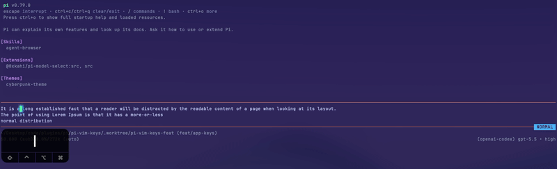

# @0xkahi/pi-vim-keys

A Vim modal input editor for [Pi](https://github.com/earendil-works/pi). Replaces Pi's default input editor with full normal, insert, visual, and visual-line modes, plus configurable leader keybindings and per-mode cursor shapes.



## Install

Install globally (writes to `~/.pi/agent/settings.json`):

```bash
pi install npm:@0xkahi/pi-vim-keys
```

Or install into the current project only (writes to `.pi/settings.json`, shareable with your team):

```bash
pi install npm:@0xkahi/pi-vim-keys -l
```

## ✨ Features

- **Vim modes**: insert, normal, visual, and visual-line modes.
- **Mode-aware cursor and colors**: configurable mode label colors, plus block cursor in normal/visual modes and bar cursor in insert mode when terminal hardware cursor is enabled.
- **Configurable insert-to-normal mapping**: use `escape` by default, or configure sequences like `jj` or `kj`.
- **Normal-mode leader keybindings**: bind leader mappings to Pi app actions or extension commands.
- **supports both single char and multichar sequence**: keybinds can be `<leader>e` or `<leader>oe`

For custom extension keybind registration, see [Extension Keybindings](docs/configuration.md#extension-keybindings).

Example:

```json
{
  "keybinds": {
    "<leader>oe": "app.editor.external",
    "<leader>p": "app.clipboard.pasteImage",
    "<leader>l": "app.session.resume",
    "<leader>g": "app.session.tree",
    "ctrl+t": "app.thinking.cycle"
  }
}
```


## 📚 Documentation

| Doc | What it covers |
|-----|----------------|
| **[Configuration](docs/configuration.md)** | Config file locations, merge order, colors, insert-to-normal remaps, leader keybinds, extension keybinding registration, and schema usage |
| **[Normal Mode](docs/normal-mode.md)** | Insert/visual mode entry, movement, word motions, find character, editing, and configured keybindings |
| **[Visual Mode](docs/visual-mode.md)** | Character-range selections, mode switching, movement, word motions, find character, and selection editing |
| **[Visual Line Mode](docs/visual-line-mode.md)** | Whole-line selections, mode switching, movement, word motions, find character, and line editing |

